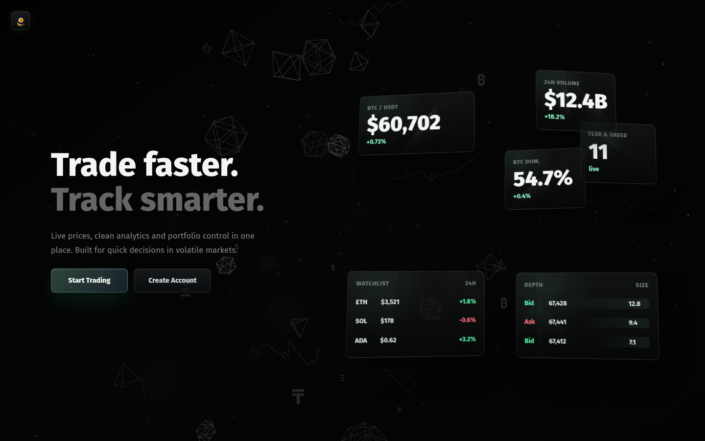
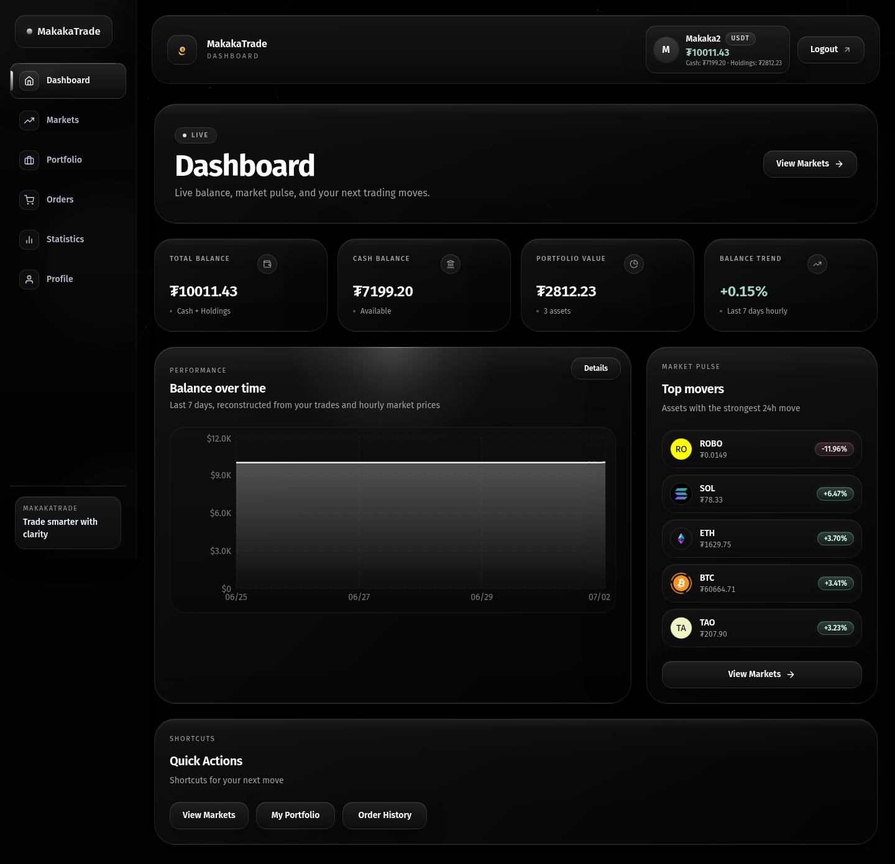
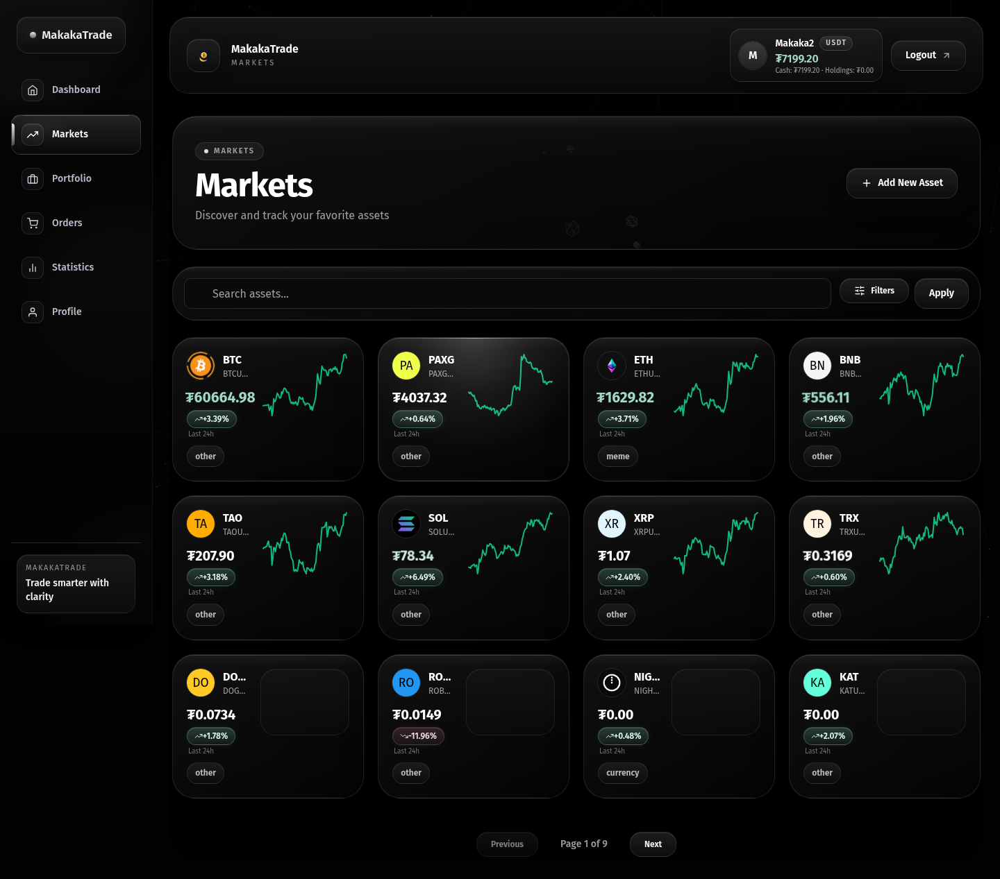
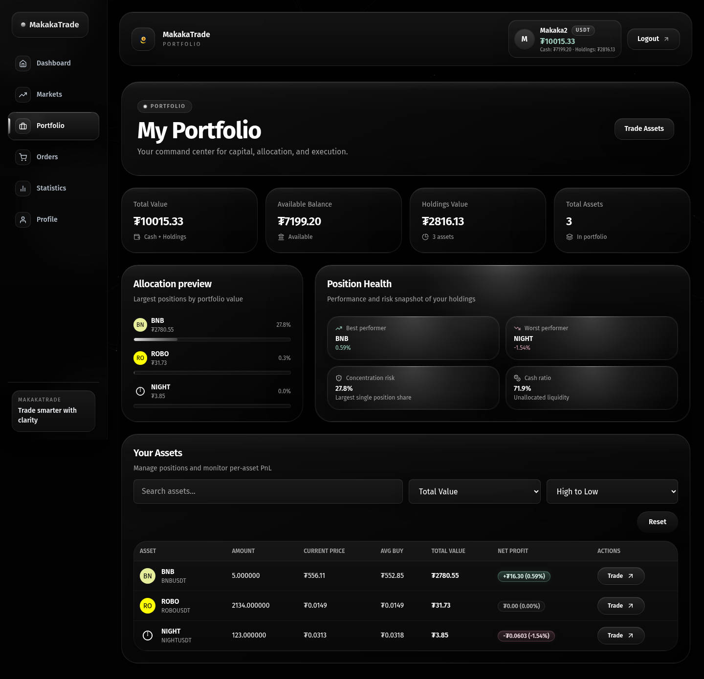
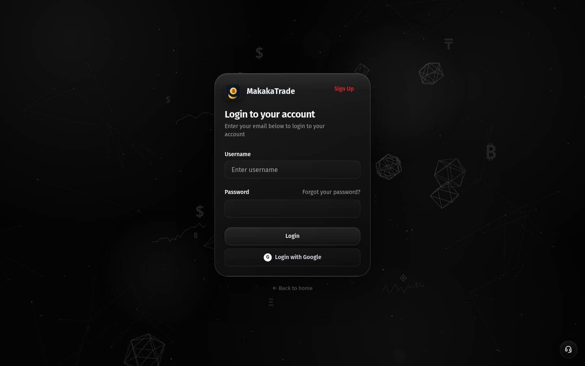
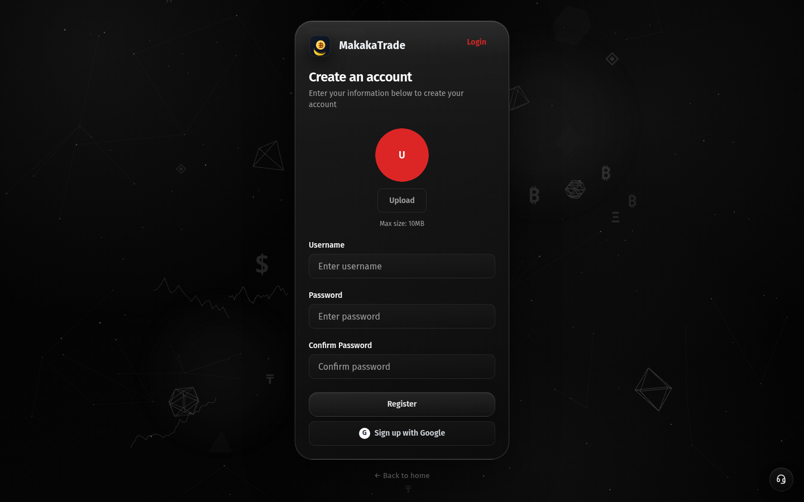

<div align="center">

# 🚀 MakakaTrade

### Modern Crypto Trading Platform

Live prices, clean analytics and portfolio control in one place.
Built for quick decisions in volatile markets.

[](https://reactjs.org/)
[](https://www.typescriptlang.org/)
[](https://vitejs.dev/)
[](https://tailwindcss.com/)
[](https://nodejs.org/)
[](https://www.sqlite.org/)
[](#)

<br/>



</div>

---

## ✨ Features

<table>
<tr>
<td width="50%">

### 📊 Real-time Trading
- **Live price updates** via WebSocket (Binance API)
- **MQTT market data** with auto-sync every 3s
- **Instant notifications** for orders & portfolio changes
- **100+ trading pairs** pre-loaded

</td>
<td width="50%">

### ⚡ Performance
- **Instant page navigation** with optimistic UI
- **Skeleton loading states** for smooth UX
- **Smart caching** for icons & market data
- **Debounced & throttled requests**

</td>
</tr>
<tr>
<td>

### 🔐 Security
- **JWT authentication** with secure cookies
- **Firebase Auth** (Google login support)
- **bcrypt** password hashing
- **CORS** protection

</td>
<td>

### 🌍 Internationalization
- **Multi-language support** (i18next)
- **Dark/Light theme** toggle
- **Responsive design** for all devices
- **shadcn/ui** components

</td>
</tr>
</table>

---

## 📸 Screenshots

### 🏠 Landing Page
> Trade faster. Track smarter.


---

### 📈 Dashboard
> Live balance, market pulse, and your next trading moves.



---

### 💹 Markets
> Discover and track your favorite assets



---

### 💼 Portfolio
> Your command center for capital, allocation, and execution.



---

### 🔑 Auth Pages

<table>
<tr>
<td></td>
<td></td>
</tr>
<tr>
<td align="center"><b>Login</b></td>
<td align="center"><b>Register</b></td>
</tr>
</table>

---

## 🛠 Tech Stack

<div align="center">

| Layer | Technologies |
|-------|-------------|
| **Frontend** | React 19 · TypeScript · Vite · Redux Toolkit · shadcn/ui · Tailwind CSS · Recharts |
| **Backend** | Node.js · Express · TypeScript · SQLite · WebSocket · MQTT |
| **Auth** | JWT · Firebase Auth · bcrypt · Cookies |
| **DevOps** | Docker Compose · Multi-stage builds · Nginx |

</div>

---

## 🚀 Quick Start

### Prerequisites
- **Docker** with Docker Compose
- Modern web browser with WebSocket support

### Launch with Docker

```bash
# Build and start everything
npm run dev
```

This starts:
| Service | URL |
|---------|-----|
| 🖥 Frontend | `http://localhost:5173` |
| ⚙️ Backend API | `http://localhost:3000` |
| 🔌 WebSocket | `ws://localhost:3000` |

### Other Commands

```bash
npm run up      # Build and start in background
npm run logs    # Follow container logs
npm run down    # Stop and remove containers
```

---

## 📁 Project Structure

```
Makakatrade/
├── docker-compose.yml        # Services orchestration
├── package.json              # Root scripts
│
├── backend-project/
│   ├── src/
│   │   ├── server.ts         # Express + WebSocket server
│   │   ├── database.ts       # SQLite setup & migrations
│   │   ├── routes/           # REST API endpoints
│   │   ├── services/         # Business logic
│   │   ├── middleware/       # Auth & validation
│   │   └── utils/            # Helpers
│   └── Dockerfile
│
└── frontend-project/
    ├── src/
    │   ├── components/       # React components
    │   │   └── ui/           # shadcn/ui components
    │   ├── pages/            # Page layouts
    │   ├── store/            # Redux state management
    │   ├── api/              # REST + WebSocket clients
    │   └── i18n/             # Translations
    ├── nginx.conf            # SPA server config
    └── Dockerfile
```

---

## 🔌 API Endpoints

### Authentication
| Method | Endpoint | Description |
|--------|----------|-------------|
| `POST` | `/api/auth/register` | Register new user |
| `POST` | `/api/auth/login` | Login |
| `GET`  | `/api/auth/profile` | Get current user |

### Trading
| Method | Endpoint | Description |
|--------|----------|-------------|
| `GET`  | `/api/portfolio` | User portfolio |
| `POST` | `/api/orders` | Place buy/sell order |
| `GET`  | `/api/orders` | Order history |

### Market Data
| Method | Endpoint | Description |
|--------|----------|-------------|
| `GET`  | `/api/assets` | All trading assets |
| `GET`  | `/api/stats` | Trading statistics |
| `WS`   | `/` | Real-time price updates |

---

## 🗄 Database Schema

```
┌──────────────┐     ┌──────────────┐     ┌──────────────┐
│    Users     │     │  Portfolio   │     │    Orders    │
├──────────────┤     ├──────────────┤     ├──────────────┤
│ id           │◄────│ user_id      │◄────│ user_id      │
│ username     │     │ asset_symbol │     │ asset_symbol │
│ password     │     │ amount       │     │ order_type   │
│ balance      │     └──────────────┘     │ amount       │
│ avatar       │                          │ price        │
└──────────────┘                          │ timestamp    │
                                          └──────────────┘
┌──────────────┐
│    Assets    │
├──────────────┤
│ symbol       │
│ name         │
│ image_url    │
│ category     │
│ is_active    │
└──────────────┘
```

> **Note:** Database auto-populates with top 100 trading pairs on first run.

---

## ⚙️ Environment Variables

### Root `.env`
```env
VITE_API_URL=http://localhost:3000/api
VITE_WS_URL=ws://localhost:3000
VITE_FIREBASE_API_KEY=your_key
VITE_FIREBASE_AUTH_DOMAIN=your_domain
VITE_FIREBASE_PROJECT_ID=your_project_id
```

### Backend
```env
PORT=3000
DB_FILE=/app/data/trading.db
CORS_ORIGIN=http://localhost:5173
FIREBASE_PROJECT_ID=your_project_id
FIREBASE_CLIENT_EMAIL=your_email
FIREBASE_PRIVATE_KEY=your_key
```

---

## 📄 License

MIT

---

<div align="center">

**Built with Vite & Express · Optimized for speed · Cross-platform**

</div>
